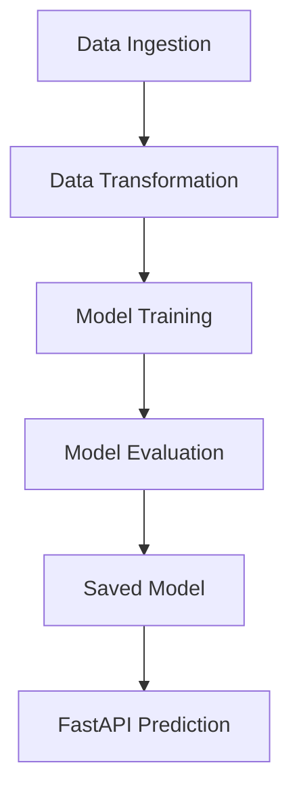

# 🚀 TextSummarizer – PEGASUS Fine-Tuning + MLOps

Projet de **Text Summarization** où j’ai finetuné  
👉 `google/pegasus-cnn_dailymail`  
sur le dataset **SAMSum** (résumé de conversations).

Objectif : construire un **pipeline MLOps complet** + une **API FastAPI** pour servir le modèle en production.

---

## 🧠 Ce que j’ai réalisé

- ⚙️ **Pipeline MLOps complet** : ingestion, transformation, training, évaluation, prédiction  
- 🧠 **Fine-tuning PEGASUS** pour résumer des dialogues  
- ⚡ **API FastAPI** pour faire des prédictions  
- 🐳 **Support Docker**  
- 🧩 Architecture propre, modulaire et scalable  

Ce projet met en avant mes compétences en **NLP, finetuning, MLOps, API Design** et **architecture logicielle**.

---

## 📂 Architecture (vue simple)




## ▶️ Comment exécuter le projet

### 1. Cloner
```bash
git clone https://github.com/faroukelmak/textsummarizer.git
cd textsummarizer
```

### 2. Installer les dépendances
```bash
pip install -r requirements.txt
```

### 3. Lancer le training
```bash
python main.py
```

### 4. Lancer l’API
```bash
uvicorn app:app --reload
```

API accessible ici :
➡️ http://localhost:8000/docs


### Workflows 

1. Config.yaml
2. Params.yaml
3. Config entity
4. configuration manager 
5. Update the components 
    - Data Ingestion 
    - Data transformation 
    - Model training
6. Create our pipeline 
    - Training Pipeline
    - Prediction Pipeline
7. Front end 
    - Api's
    - Training Api's
    - Batch Prediction Api's
